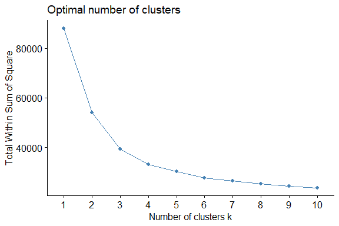
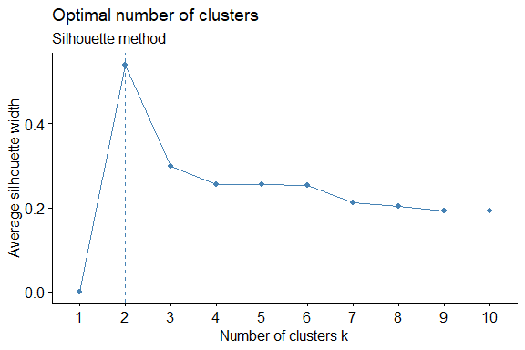
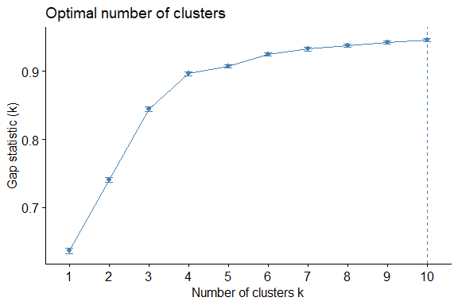
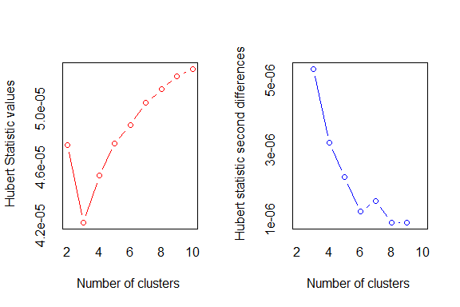
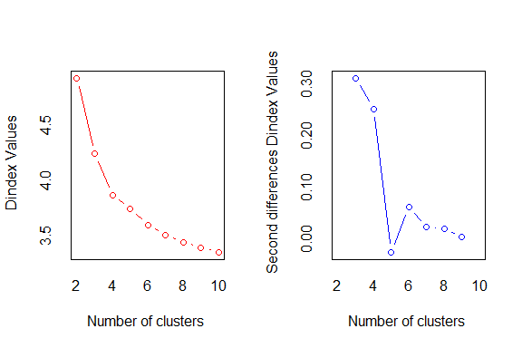
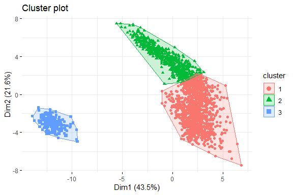
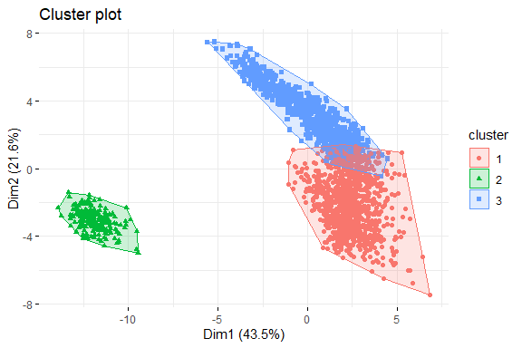
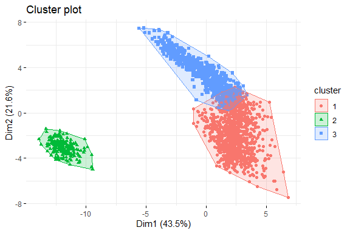

## Clustering Fifa players

Clustering Fifa 17 players according to their attributes using partitional clustering.

Load packages.

``` r
library(ggpubr)
library(factoextra)
library(NbClust)
library(cluster)
library(fossil)
```

Load FIFA 17 Data load(\~/fifa.RData)

Retrieve numeric variables. In this sample the top 2000 players are extracted.

``` r
fut<-fifa[1:2000,c(7,17,18,20,22,23,24,25,26,27,34:67)]
```

Scale data.

``` r
fut.z <- scale(fut , center = TRUE , scale = TRUE)
```

### Within sum of squares for elbow rule.

``` r
fviz_nbclust(fut.z, kmeans, nstart=25, iter.max=500, method = "wss")
```



### Silhouette method.

``` r
fviz_nbclust(fut.z, kmeans, method = "silhouette", k.max=10, nstart=25, iter.max=500)+
  labs(subtitle = "Silhouette method")
```



### GAP Statistic

``` r
set.seed(123)
fviz_nbclust(fut.z, kmeans, nstart = 25,iter.max=500 ,  method = "gap_stat", nboot = 50)
```



### NBClust

Check multiple indices using NBClust.

``` r
set.seed(123)
res.kmeans.NbClust <- NbClust(fut.z,
                              distance = "euclidean",
                              min.nc = 2, max.nc = 10,
                              method = "kmeans")
```



    ## *** : The Hubert index is a graphical method of determining the number of clusters.
    ##                 In the plot of Hubert index, we seek a significant knee that corresponds to a 
    ##                 significant increase of the value of the measure i.e the significant peak in Hubert
    ##                 index second differences plot. 
    ## 



    ## *** : The D index is a graphical method of determining the number of clusters. 
    ##                 In the plot of D index, we seek a significant knee (the significant peak in Dindex
    ##                 second differences plot) that corresponds to a significant increase of the value of
    ##                 the measure. 
    ##  
    ## ******************************************************************* 
    ## * Among all indices:                                                
    ## * 10 proposed 2 as the best number of clusters 
    ## * 9 proposed 3 as the best number of clusters 
    ## * 3 proposed 4 as the best number of clusters 
    ## * 1 proposed 8 as the best number of clusters 
    ## * 1 proposed 10 as the best number of clusters 
    ## 
    ##                    ***** Conclusion *****                            
    ##  
    ## * According to the majority rule, the best number of clusters is  2 
    ##  
    ##  
    ## *******************************************************************

### Number of clusters for K-Means

2 clusters is a too simplistic representation. Select 3 clusters.

``` r
set.seed(100)
res.kmeans.3 <- kmeans(fut.z,
                       centers = 3,
                       nstart = 50,
                       iter.max = 1000)
res.kmeans.3$size
```

    ## [1] 1188  612  200

### 2 Dimensional plot K-Means

``` r
fviz_cluster(res.kmeans.3, fut.z, 
             geom = "point",
             ellipse.type = "convex", 
             ggtheme = theme_minimal()
)
```



### Use Partitioning Around Medodoids (PAM)

``` r
res.pam.3 <- pam(fut.z, k = 3,metric = "euclidean", nstart=50, stand = FALSE)
```

### 2 Dimensional plot PAM

``` r
fviz_cluster(res.pam.3,
             geom = "point",
             ellipse.type = "convex",
             ggtheme = theme_minimal()
)
```


### Clara 

stand=FALSE because variables are already standardized. In
subsets of 20.

``` r
res.clara.3<-clara(fut.z, 3, metric = "euclidean", stand = FALSE, 
      samples = 20, pamLike = TRUE)
```

### 2 Dimensional plot Clara

``` r
fviz_cluster(res.clara.3,
             geom = "point",
             ellipse.type = "convex",
             ggtheme = theme_minimal()
)
```



### Rand Index

``` r
rand.index(res.clara.3$clustering, res.pam.3$clustering)
```

    ## [1] 0.9394197

``` r
rand.index(res.pam.3$clustering, res.kmeans.3$cluster)
```

    ## [1] 0.8385213

``` r
rand.index(res.clara.3$clustering, res.kmeans.3$cluster)
```

    ## [1] 0.8761881
